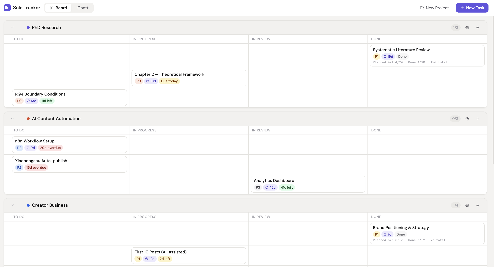
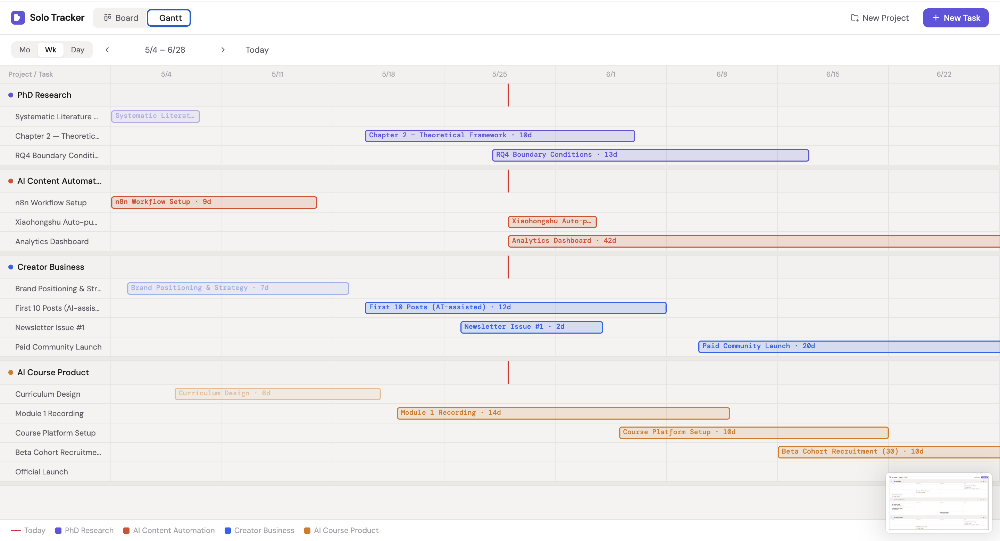

# Solo Tracker

**A no-nonsense project tracker for solo builders — kanban + gantt, zero setup.**

> Built by [Clora Chen](https://github.com/clorachen) — a PhD researcher and AI entrepreneur who got tired of paying for features she never uses.





---

## Why Solo Tracker?

Most project management tools are built for teams. They come with collaboration features, permission systems, and complex onboarding — none of which you need when you're working alone.

Solo Tracker does one thing: **gives you a clear view of all your projects at once**, without the noise.

- **Kanban board** — drag tasks across status columns, see every project in one scroll
- **Gantt chart** — month / week / day views, drag to reschedule, see where everything stands on a timeline
- **Zero setup** — open the file, start working. No account, no subscription, no configuration
- **Your data stays yours** — everything is stored locally in your browser, nothing is sent anywhere

---

## Who is this for?

Solo Tracker is designed for people who wear multiple hats and run multiple projects at the same time:

- AI founders / indie hackers validating multiple ideas in parallel
- PhD students and researchers juggling writing, experiments, and submissions
- Freelancers managing multiple clients
- Content creators running across multiple platforms
- Side-project builders with a day job

---

## Features

| Feature | Details |
|---|---|
| Multi-project kanban | Each project gets its own swim lane, row-aligned grid |
| Gantt chart | Month / week / day zoom, today line, drag & resize bars |
| Task status | To Do → In Progress → In Review → Done |
| Priority tags | P0 / P1 / P2 / P3 with color coding |
| Time tracking | Auto-records when each task entered each status |
| Done card timeline | Shows planned dates, actual completion, and total days |
| Drag to reorder | Reorder tasks and projects by dragging |
| Inline project rename | Click project name to edit directly |
| Collapse lanes | Fold projects you're not focusing on |
| Local persistence | Data saved to localStorage, survives browser/computer restarts |
| Dark mode | Automatic, follows system preference |
| Zero dependencies | Single HTML file, no build tools, no frameworks |

---

## Getting Started

**Option 1 — Use it now (free, open source)**

```bash
git clone https://github.com/clorachen/solo-tracker.git
open solo-tracker.html
```

Or just [download the HTML file](https://github.com/clorachen/solo-tracker/releases) and open it in your browser.

**Option 2 — Support the project ($9, one-time)**

If Solo Tracker saves you time and you want to support continued development:

👉 **[Buy for $9 — one-time, no subscription](YOUR_LEMON_SQUEEZY_LINK)**

You get the same file. The $9 is a way to say "keep building this."

---

## Roadmap

- [ ] Tauri desktop app (Mac + Windows)
- [ ] Cloud sync (optional, privacy-first)
- [ ] AI task breakdown (describe a goal, get subtasks)
- [ ] Export to PDF / CSV

---

## License

[CC BY-NC 4.0](./LICENSE) — Free for personal, non-commercial use.  
For commercial use, please [get in touch](mailto:hello@clorachen.com).

---

## About

Made by **Clora Chen** ([@clorachen](https://github.com/clorachen))

I'm a PhD researcher studying AI-driven solo entrepreneurship, and also an AI entrepreneur myself. I built Solo Tracker because I needed it — I was running a research project, multiple business experiments, and content creation simultaneously, and every tool I tried was either too heavy or too expensive for what I actually needed.

This project is also a living case study for my research. If you're a solo builder using AI tools to run your projects, I'd love to hear from you.

---

*Solo Tracker is open source and free to use. If it's useful to you, a star ⭐ means a lot.*
